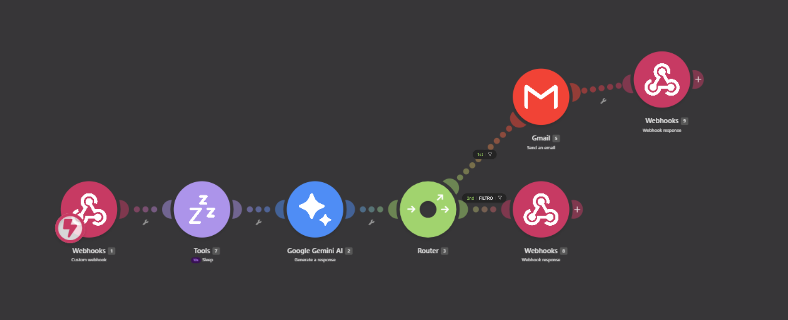

# sampa-agente-ia-municipal
(Projeto acadêmico) Agente de IA que atende cidadãos de uma prefeitura fictícia, classificando mensagens por urgência e respondendo automaticamente, construído com Make, Gemini e engenharia de prompt.

Assistente virtual desenvolvido para uma prefeitura fictícia (Serranópolis), capaz de entender a mensagem de um cidadão, decidir sozinho se é uma urgência ou uma dúvida comum, e agir de forma diferente em cada caso — respondendo diretamente ou abrindo um chamado por e-mail.

Projeto em grupo, desenvolvido como trabalho acadêmico.

 ## Sumário
 
- [O problema](#o-problema)
- [O que o Sampa faz](#o-que-o-sampa-faz)
- [Arquitetura](#arquitetura)
- [Desafios técnicos (e como resolvemos)](#desafios-técnicos-e-como-resolvemos)
- [Testes de estresse](#testes-de-estresse)
- [Considerações éticas](#considerações-éticas)
- [O que eu faria diferente / próximos passos](#o-que-eu-faria-diferente--próximos-passos)
- [Stack](#stack)
## O problema
 
A maioria dos municípios brasileiros ainda não tem canais digitais eficientes de atendimento — o cidadão depende de ligação ou visita presencial até para tirar dúvidas simples sobre IPTU, saúde, zeladoria ou educação. Quisemos testar se um agente de IA, construído inteiramente com ferramentas acessíveis (sem orçamento de infraestrutura), conseguiria resolver parte desse gargalo.
 
## O que o Sampa faz
 
- Recebe a mensagem do cidadão pela interface do site
- Classifica automaticamente: **urgência** (ex: queda de árvore, problema de zeladoria) ou **dúvida geral** (IPTU, saúde, educação etc.)
- Se for urgência → abre um chamado automático por e-mail para a prefeitura
- Se for dúvida geral → responde diretamente, com base num manual de serviços municipais
## Arquitetura
 
O sistema foi montado em 4 camadas:
 
| Camada | Ferramenta | Função |
|---|---|---|
| Interface | Google AI Studio | Site onde o cidadão manda a mensagem |
| Processamento | Make | Orquestra o fluxo, recebe o input via webhook |
| Inteligência | Gemini 2.0 Flash Lite | Entende a mensagem, gera a resposta, classifica a urgência |
| Ação | Router (Make) + Gmail | Decide o caminho: e-mail de chamado ou resposta direta |
 
**Como a base de conhecimento foi montada:** usamos o ChatGPT para estruturar o prompt do manual de serviços (IPTU, Saúde, Zeladoria, Educação), o Claude para gerar esse manual completo em PDF, e o Gemini para definir a persona da Sampa e incorporar links de fontes oficiais do governo de SP como contexto extra.
 
 
## Desafios técnicos (e como resolvemos)
 
- **Instabilidade na versão gratuita do Make:** os módulos falhavam quando rodavam em sequência imediata. Resolvido inserindo um módulo de espera (Sleep) de 10 segundos, o que estabilizou o fluxo por completo.
- **Formatos incompatíveis entre ferramentas:** cada ferramenta (ChatGPT, Claude, Gemini, Make, Google AI Studio) tem seu próprio formato de entrada/saída — precisamos converter o manual de PDF para `.txt` e ajustar a configuração da API do Gemini no Make.
- **Calibração do Router:** o filtro que decide "isso é urgente ou não" precisou de várias rodadas de teste até classificar corretamente os diferentes tipos de mensagem.
## Testes de estresse
 
Testamos o agente contra cenários adversos, não só o uso esperado:
 
- Perguntas fora do escopo (política, assuntos pessoais) → a Sampa redirecionava educadamente, sem responder
- Linguagem ofensiva → manteve tom institucional, sem reproduzir o conteúdo
- Tentativas de injeção de prompt (ex: "ignore suas instruções anteriores...") → a Sampa ignorou e manteve o comportamento original
- Mensagens incompletas ou sem sentido → pediu reformulação, sem travar
  
## Considerações éticas
 
Documentamos no projeto os principais riscos de um agente assim em produção: viés algorítmico (mitigado com linguagem neutra no prompt), privacidade (não há armazenamento persistente de dados — em uma versão real seria necessária adequação à LGPD), segurança contra injeção de prompt, e a importância de deixar claro ao cidadão que está falando com uma IA, não com um servidor público.
 
## O que eu faria diferente / próximos passos
 
- Integrar com um banco de dados real para o cidadão acompanhar o status do chamado
- Expandir a base de conhecimento para outras áreas (Habitação, Transporte, Assistência Social)
- Adicionar autenticação de usuário para personalizar o atendimento
  
## Stack
`Make` · `Google AI Studio` · `Gemini 2.0 Flash Lite` · `ChatGPT` (engenharia de prompt) · `Claude` (geração de documentação) · `Gmail API`
 
